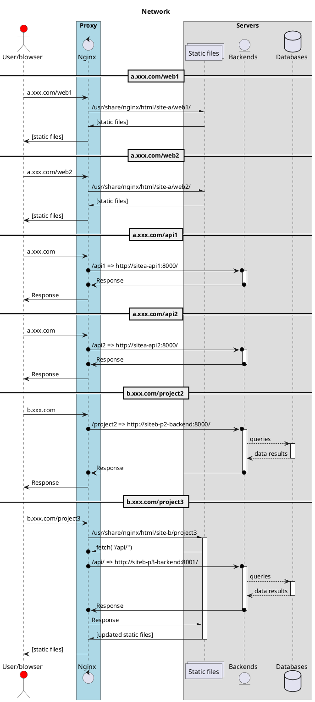

# docker-nginx-deploy

> A deploy example that can be used to deploy your multi-services in your server by using docker and nginx.

## 应用背景

1. 目的是在服务器使用 nginx 管理多个服务。
2. 因为其他服务都是用 docker 容器管理运行，为方便 nginx 服务使用 docker network 访问其他服务，所以也使用 docker 来管理 Nginx 代理。
3. 服务器只开放 80 端口，所有服务使用 Nginx 代理转发。
4. 有子域名两个，分别是`a.xxx.com`，`b.xxx.com`。
5. 计划有三大项目：
   1. Project1: Reactjs(前端 1) + Reactjs(前端 2) + Django(后端 1) + Flask(后端 2)
   2. Project2(后端全栈服务): Flask + Mysql
   3. Project3(前端全栈服务): Reactjs + Nodejs + Mysql
6. 项目与各域名的部署情况
   1. a.xxx.com：
      - web1/: Reactjs(前端 1)
      - web2/: Reactjs(前端 2)
      - api1/: Django(后端 1)
      - api2/: Flask(后端 2)
   2. b.xxx.com:
      - project2/: Flask
      - project3/: Reactjs

## 文件结构

```
.
├── basic-nginx/
├── a.xxx.com/
└── b.xxx.com/
```

## 项目前提

1. 熟悉 docker 及 docker compose 基础
2. 在 /etc/hosts 中新增两个域名用于测试
   ```
   127.0.0.1 a.xxx.com
   127.0.0.1 b.xxx.com
   ```
3. 创建一个公共的网络用于 Nginx 代理与其他服务沟通
   ```
   docker network create proxy-network
   ```

## 网络关系


